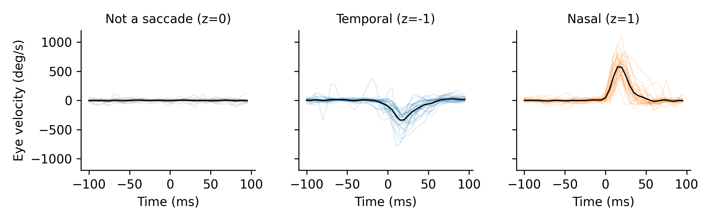

# Saccade decoder
This is a repository that showcases a set of neural decoders implemented with PyTorch. The models are being used to decode eye movement kinematics (velocity) using neural data (single-unit spiking).

# Data
For these analyses I'm using a dataset I collected during my PhD which can be downloaded [here](https://datadryad.org/dataset/doi:10.5061/dryad.cnp5hqcfn). I call this dataset the "Mlati" dataset, which stands for medial-lateral axis tangential insertion. This refers to the geometry of how a high density linear electrode array was inserted into the brains of mice. Briefly, the data for each session in this dataset is stored in an h5 file with the filenameing convention "\<date>_\<animal>_store.hdf." I created the `data` module to interface with the Mlati dataset using these h5 files.

## Loading training data
Here is an example that demonstrates how to load the neural activity and eye velocity signals from a single experiment.
```Python
from saccade_decoder import data
X, y, z = data.load_mlati(<path to h5 file>)
```
The `load_mlati` function extracts spiking activity and eye velocity signals from the h5 files and organizes them into these ML-ready variables:
- `X` (N saccades x M features) - Numpy array where N is the number of saccades in the recording and M is the firing rate for each neuron in the recording relative to each saccade
- `y` (N saccades x P features) - Numpy array where N is the number of saccades and P is the eye velocity for each saccade in a window of time around the saccade
- `z` (N saccades x 1) - Numpy array where N is the number of saccades and each entry indicates the direction of the saccade (-1, 0, 1): -1 is a temporal movement, 1 is a nasal movement, and 0 is not a saccade

## Features (saccade waveforms)
The `y` variable returned by the `load_mlati` function contains the velocity waveforms for each saccade in the training dataset; whereas, the `z` variable indicates the type of saccade. The saccade waveforms represent how fast the eye was moving in a window of time around the beginning of the saccade and will be used as the target variables for regression. In the figure below, I'm showing 30 samples (and the mean) of each "type" of saccade: "Not a saccade," "Temporal" saccades, and "Nasal" saccades.

<p align="center">
  
</p>

# Multi-layer perceptron
I implemented a simple Multi-layer perceptron regressor using PyTorch which uses the same conventions for interfacing as Scikit-Learn's `MLPRegressor`.
```Python
from saccade_decoder import mlp
reg = mlp.PyTorchMLPRegressor()
reg.fit(X, y)
```
