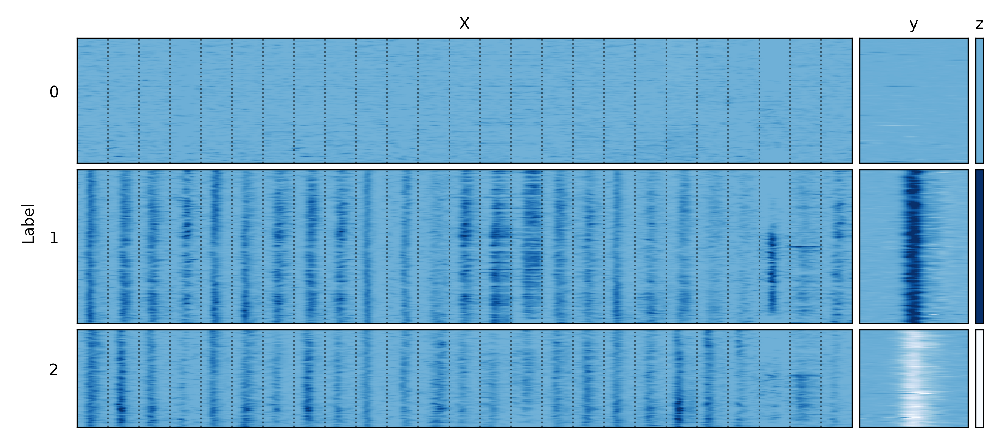

# Introduction
This is a repository that showcases a set of neural decoders implemented with PyTorch. The models are being used to decode eye movement kinematics (velocity) using neural data (single-unit spiking).


# 1. Interfacing with the Mlati dataset
For these analyses I'm using a dataset I collected during my PhD which can be downloaded [here](https://datadryad.org/dataset/doi:10.5061/dryad.cnp5hqcfn). Briefly, the data for each experiment in this dataset is stored in an h5 file with the filenameing convention "\<date>_\<animal>_store.hdf." I created the `sdpy.data` module to interface with the Mlati dataset using these h5 files. Here is an example that demonstrates how to load the neural activity and eye velocity signals for a single experiment.
```Python
from sdpy import data
mlati = data.Mlati(<path to h5 file>)
```
The `sdpy.data.Mlati` class stores data in 3 attributes:
- `Mlati.X` - The `X` attribute contains neural activity in a window of time around the onset of saccades. The matrix is organized neuron-major/bin-minor such that each row is formed by the concatenation of multiple single-trial peri-stimulus time histograms (PETHs). Therefore, the size of the second dimension of `X` is the number of time bins in the PETHs x the number of neurons in the recording.
- `Mlati.y` - The `y` attribute contains the velocity waveforms (in deg/s) for each saccade.
- `Mlati.z` - The `z` attribute indicates the type of saccade: 0 (Null), 1 (Nasal), or 2 (Temporal).

Here is a plot that visualizes the first 500 columns of `X` (i.e, the first 25 neurons), all values of `y`, and all values of `z`. Samples are grouped by the type of saccade along the y-axis, and for `X`, boundaries between individual neurons are indicated with a dotted black line.

<p align="center">
  
</p>


# 2. Predicting the "type" of saccade
I wanted to see if I could use peri-saccadic single-unit spiking to predict 1.) if the animal made a saccade and 2.) the direction of each saccade that was made. To do this, I implemented an Multi-layer perceptron (MLP) classifier with PyTorch. You can find the implementation [here](https://github.com/jbhunt/saccade-decoder/blob/7556287ea31d8e364d5fe4fc0428b654b108bed8/sdpy/mlp.py#L197). My implementationd - `sdpy.mpl.PyTorchMLPClassifier` - emulates the design and interface used by scikit-learn. For example, this class has both a `fit` and `predict` method.
```Python
from sdpy import mlp, data
from sklearn.model_selection import train_test_split
mlati = data.Mlati(<path to h5 file>)
X_train, X_test, y_train, y_test = test_train_split(mlati.X, mlati.z, test_size=0.2)
clf_pt = mlp.PyTorchMLPClassifier()
clf_pt.fit(X_train, y_train)
y_predicted = clf_pt.predict(X_test)
```
And as a sanity check, I compared the cross-validated performance of my implementation with scikit-learn's `sklearn.neural_network.MPLClassifier` class.
```Python
from sklearn.neural_network import MLPClassifier
from sklearn.model_selection import cross_val_score, accuracy_score
from sklearn.metrics import make_scorer
clf_sk = MLPClassifier(solver='adam', max_iter=1000) # Set hyperparameters to match my implementation for a fair comparison
acc_score_pt = cross_val_score(clf_pt, mlati.X, mlait.z, scoring=make_scorer(accuracy_score), cv=5).mean() # returns 0.85
acc_score_sk = cross_val_score(clf_sk, mlati.X, mlati.z, scoring=make_scorer(accuracy_score), cv=5).mean() # returns 0.75
```
On my machine, the Scikit-learn implementation is ~75% accuracte and my implementation with PyTorch is ~83% accurate. Here is a visualization that shows the confusion matrices (CM) for each model. The CMs are normalized to the sum of the columns such that the color of each cell indicates the fraction of predictions for each class that were correct (along the diagonal) or incorrect (above or below the diagonal). The raw frequencies are shown in black text within each cell.

<p align="center">
  
</p>

Both models do pretty well decoding the type of saccade using neural activity with sklearn's MLP struggling a little bit more to predict null events (z=0).


# 3. Decoding peri-saccadic eye velocity
Next, I wanted to see if I could decode eye velocity using single-unit spiking. Unlike saccade type which is a categorical variable, eye velocity is a continuous time-series, so the type of problem changes from classification to regression. To decode eye velocity, I implemented an MLP-based regressor using PyTorch and compared its performance to scikit-learn's `sklearn.neural_network.MLPRegressor` class. From left to right, the columns in the figure below show the test eye velocity waveforms, the predicted eye velocity waveforms using scikit-learn's regressor, the predicted eye velocity waveforms using my regressor, the residuals from scikit-learn's predictions, and the residuals from my regressor's predictions. I've grouped the samples by the type of saccade for visualization. The solid lines on top of each subplot show the average eye velocity for that subset of samples.

<p align="center">
  
</p>

The regressors are good, but not great at decoding eye velocity from neural activity: scikit-learn's regressor produces a RMSE of 270 deg/s and an $R^2$ of 0.58; my regressor produces a RMSE of 272.7 deg/s and an $R^2$ of 0.57. It seems like the regressors are predicting the correct sign (i.e., positive or negative peaks in velocity), but understimating the amplitude of the eye velocity waveforms. Decoding eye velocity appears to be a more difficult problem than decoding the type of saccade.


# 4. Decoding continuous eye velocity
Next, I wanted to try my hand at real-time neural decoding with deep learning à la brain-computer interfaces. First, to get a sense of the optimal lag between neural activity and velocity, I analyzed the cross-validated performance of an MLP regressor trained on neural activity to predict continuous eye velocity.

The training data (`X`) consists of binned spike counts from a sliding time window run across the entire recording. For each forward shift of the sliding window, I collected eye velocity from a time point at a constant lag from the end of the window; these data became the target variable (`y`). The `sdpy.data.Mlati` class implements this sliding time window.
```Python
from sdpy import data
mlati = data.Mlati(<path to h5 file>, form='W') # W for windowed
```

The figure below shows true eye velocity (top row), decoded eye velocity (middle row), and residual eye velocity (bottom row) for a test dataset (last fifth of the recording) from an example recording in which the decoder performed well.

<p align="center">
  
</p>

Here is a zoomed in view of the eye velocity signals during several saccadic eye movements. Dark blue is the true eye velocity and light blue is the decoded eye velocity.

<p align="center">
  
</p>

For this example recording, the decoder does pretty well using neural activity to predict continuous eye velocity; however, it seems to still be underestimating the amplitude of high velocity events like saccadic eye movements. This is similar to what I observed in section 3.

 I repeated this model training for a range of time lags spanning -1 to +1 s relative to the end of the sliding time window. The figure below shows 47 curves (light blue) representing the coefficient of determination (measured on a test dataset) as a function of time lag for each of the 47 recordings in the Mlati dataset. The dark blue curve shows the mean across recordings, the dark blue horizontal line indicates the width of the sliding window, and the dashed vertical line indicates the end of the sliding window.

<p align="center">
  
</p>

Interestingly, neural activity is highly informative of eye velocity 0 to ~350 ms in the past, although performance is variable from recording to recording. This makes sense given that I targeted my recordings to a visual brain structure. Eye movements elicit visual responses in the neurons I recorded from, so these responses are useful for decoding past eye movements. 

I was kind of surprised that all the curves rectify around 0 s; the model was unable to decode near-future eye velocity from neural activity. I assumed I picked up at least some neurons with premotor responses, so I expected that the model would have some ability to decode near-future eye velocity, but that doesn't seem the case. In the future, I'd like to see if including only neurons with premotor activity (i.e., excluding purely visual neurons) has any effect on the ability of this model to predict near-future eye velocity.

# 5. Neural decoding with an RNN
Finally, I implemented a many-to-one long short-term memory (LSTM) model that predicts future eye velocity given a sequence of neural activity from a lagged time window. LSTM models are the de facto standard for real-time neural decoding because they explicitly model temporal structure. To use the LSTM regressor, you need to reshape the data into a continous time series. To do this, you can use the `sdpy.data.Mlati` class and the `form` keyword argument.
```Python
from sdpy import data
mlati = data.Mlati(<path to h5 file>, form='C') # C for continuous
```
My implementation of an LSTM model can be found at `sdpy.rnn.PyTorchRNNRegressor`. As with the previous implementations, I emulated scikit-learn's interface giving the class `fit` and `predict` methods.
```Python
from sdpy import rnn, utils
reg = rnn.PyTorchRNNRegressor()
X_train, X_test, y_train, y_split = utils.split_time_series(mlati.X, mlati.y, test_fraction=0.2) # Helper function for splitting up data into training and test datasets
reg.fit(X_train, y_train)
y_predicted = rnn.predict(X_test)
``` 
The hyperparameters that can be tuned are:
- `n_steps` - The size of the input sequence (in bins)
- `n_units` - The number of memory cells in each layer of the LSTM
- `n_layers` - The number of layers in the LSTM
I used scikit-learn's `GridSearchCV` class to search the parameter space for the optimal values of each hyperparameter.
```Python
from sklearn.model_selection import TimeSeriesSplit, GridSearchCV
param_grid = {
    'n_steps': [1, 10, 30],
    'n_units': [4, 16, 128],
    'n_layers': [1, 5, 10],
}
cv = TimeSeriesSplit(5)
reg = rnn.PyTorchRNNRegressor(max_iter=500) # Lower the maximum number of training epochs to speed up the search
gs = GridSearchCV(reg, param_grid, cv=cv)
```
I'm still working on a detailed analysis of performance of the LSTM; it is a very computationally intensive process searching the hyperparameter space, but it seems like the RNN doesn't do a great job predicting future eye velocity. This is consistent with the result of using a feedforward model to predict continuous eye velocity. It seems like I was mostly recording from visual neurons whose activity isn't informative of intended eye movements.