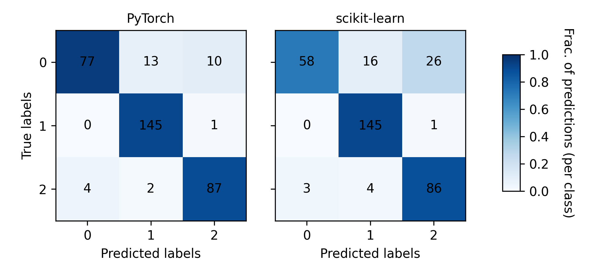

# Introduction
This is a repository that showcases a set of neural decoders implemented with PyTorch. The models are being used to decode eye movement kinematics (velocity) using neural data (single-unit spiking).

# Data
## Interfacing with the Mlati dataset
For these analyses I'm using a dataset I collected during my PhD which can be downloaded [here](https://datadryad.org/dataset/doi:10.5061/dryad.cnp5hqcfn). Briefly, the data for each experiment in this dataset is stored in an h5 file with the filenameing convention "\<date>_\<animal>_store.hdf." I created the `sdpy.data` module to interface with the Mlati dataset using these h5 files. Here is an example that demonstrates how to load the neural activity and eye velocity signals for a single experiment.
```Python
from sdpy import data
X, y, z = data.load_mlati(<path to h5 file>)
```
The `sdpy.data.load_mlati` function returns 3 variables:
- `X` - The `X` variable contains neural activity in a window of time around the onset of saccades. The matrix is organized neuron-major/bin-minor such that each row is formed by the concatenation of multiple single-trial peri-stimulus time histograms (PETHs). Therefore, the size of the second dimension of `X` is the number of time bins in the PETHs x the number of neurons in the recording.
- `y` - The `y` variable contains the velocity waveforms (in deg/s) for each saccade.
- `z` - The `z` variable indicates the type of saccade: 0 (Null), 1 (Nasal), or 2 (Temporal).

Here is a plot that visualizes the first 500 columns of `X` (i.e, the first 25 neurons), all values of `y`, and all values of `z`. Samples are grouped by the type of saccade along the y-axis, and for `X`, boundaries between individual neurons are indicated with a dotted black line.

<p align="center">
  
</p>

# Modeling
Below are some examples showcasing various implementations of machine learning models and techniques applied to this dataset.

## Predicting saccade type with a multi-layer perceptron
I wanted to see if I could use peri-saccadic single-unit spiking to predict 1.) if the animal made a saccade and 2.) the direction of each saccade that was made. To do this, I implemented an Multi-layer perceptron (MLP) classifier with PyTorch. You can find the implementation [here](https://github.com/jbhunt/saccade-decoder/blob/7556287ea31d8e364d5fe4fc0428b654b108bed8/sdpy/mlp.py#L197). My implementationd - `sdpy.mpl.PyTorchMLPClassifier` - emulates the design and interface used by scikit-learn. For example, this class has both a `fit` and `predict` method.
```Python
from sdpy import mlp, data
from sklearn.model_selection import train_test_split
X, y, z = data.load_mlati(<path to h5 file>)
X_train, X_test, y_train, y_test = test_train_split(X, z, test_size=0.2)
clf_pt = mlp.PyTorchMLPClassifier()
clf_pt.fit(X_train, y_train)
y_predicted = clf_pt.predict(X_test)
```
And as a sanity check, I compared the cross-validated performance of my implementation with scikit-learn's `sklearn.neural_network.MPLClassifier` class.
```Python
from sklearn.neural_network import MLPClassifier
from sklearn.model_selection import cross_val_score, accuracy_score
from sklearn.metrics import make_scorer
clf_sk = MLPClassifier(solver='adam', max_iter=1000) # Set hyperparameters to match my implementation for a fair comparison
acc_score_pt = cross_val_score(clf_pt, X, z, scoring=make_scorer(accuracy_score), cv=5).mean() # returns 0.85
acc_score_sk = cross_val_score(clf_sk, X, z, scoring=make_scorer(accuracy_score), cv=5).mean() # returns 0.75
```
On my machine, the Scikit-learn implementation is ~75% accuracte and my implementation with PyTorch is ~83% accurate. Here is a visualization that shows the confusion matrices (CM) for each model. The CMs are normalized to the sum of the columns such that the color of each cell indicates the fraction of predictions for each class that were correct (along the diagonal) or incorrect (above or below the diagonal). The raw frequencies are shown in black text within each cell.

<p align="center">
  
</p>

Both models do pretty well decoding the type of saccade using neural activity with sklearn's MLP struggling a little bit more to predict null events (z=0).

## Decoding eye velocity with a multi-layer perceptron
Next, I wanted to see if I could decode eye velocity using single-unit spiking. Unlike saccade type which is a categorical variable, eye velocity is a continuous time-series, so the type of problem changes from classification to regression. To decode eye velocity, I implemented an MLP-based regressor using PyTorch and compared its performance to scikit-learn's `sklearn.neural_network.MLPRegressor` class. From left to right, the columns in the figure below show the test eye velocity waveforms, the predicted eye velocity waveforms using scikit-learn's regressor, the predicted eye velocity waveforms using my regressor, the residuals from scikit-learn's predictions, and the residuals from my regressor's predictions. I've grouped the samples by the type of saccade for visualization. The solid lines on top of each subplot show the average eye velocity for that subset of samples.

<p align="center">
  
</p>

The regressors are good, but not great at decoding eye velocity from neural activity: scikit-learn's regressor produces a RMSE of 270 deg/s and an $R^2$ of 0.58; my regressor produces a RMSE of 272.7 deg/s and an $R^2$ of 0.57. It seems like the regressors are predicting the correct sign (i.e., positive or negative peaks in velocity), but understimating the amplitude of the eye velocity waveforms. Decoding eye velocity appears to be a more difficult problem than decoding the type of saccade.

## Simulating real-time decoding of eye velocity using a recurrent neural network (LSTM)
Finally, I wanted to try my hand at real-time neural decoding with deep learning à la brain-computer interfaces. I implemented a many-to-one long short-term memory (LSTM) model that predicts future eye velocity given a sequence of neural activity from a lagged time window. To simulate a real-time decoding paradigm I created a function that loads neural activity and  eye velocity sampled at the same frequency over the entire duration of the recording. You can change the sampling frequency by changing the `Xy_binsize` keyword argument (the default is 10 ms time bins). In the example below, `X` is a N time bins x M units NumPy array that stores binned spike counts for all units and `y` is a N time bins x 1 NumPy array that stores eye velocity.
```Python
from sdpy import data
X, y = data.load_mlati_continuous(<path to h5 file>, Xy_binsize=0.01)
```

The LSTM model is located at `sdpy.rnn.PyTorchRNNRegressor`, and as with the previous models, I emulated scikit-learn's model interface.
```Python
from sdpy import rnn
reg = rnn.PyTorchRNNRegressor()
X_train, X_test, y_train, y_split = rnn.split_time_series(X, y, test_fraction=0.2) # Helper function for splitting up data into training and test datasets
reg.fit(X_train, y_train)
y_predicted = rnn.predict(X_test)
``` 
The major hyperparameters that can be tuned are:
- `n_steps` - The size of the sequence used for training (in bins)
- `n_units` - The number of memory cells in each layer of the LSTM
- `n_layers` - The number of layers in the LSTM
I used scikit-learn's `GridSearchCV` class to search the parameter space for the optimal values
```Python
from sklearn.model_selection import TimeSeriesSplit, GridSearchCV
param_grid = {
    'n_steps': [1, 10, 30],
    'n_units': [4, 16, 128],
    'n_layers': [1, 5, 10],
}
cv = TimeSeriesSplit(5)
reg = rnn.PyTorchRNNRegressor(max_iter=500) # Lower the maximum number of training epochs to speed up the search
gs = GridSearchCV(reg, param_grid, cv=cv)
```
A detailed performance evaluation is coming soon!